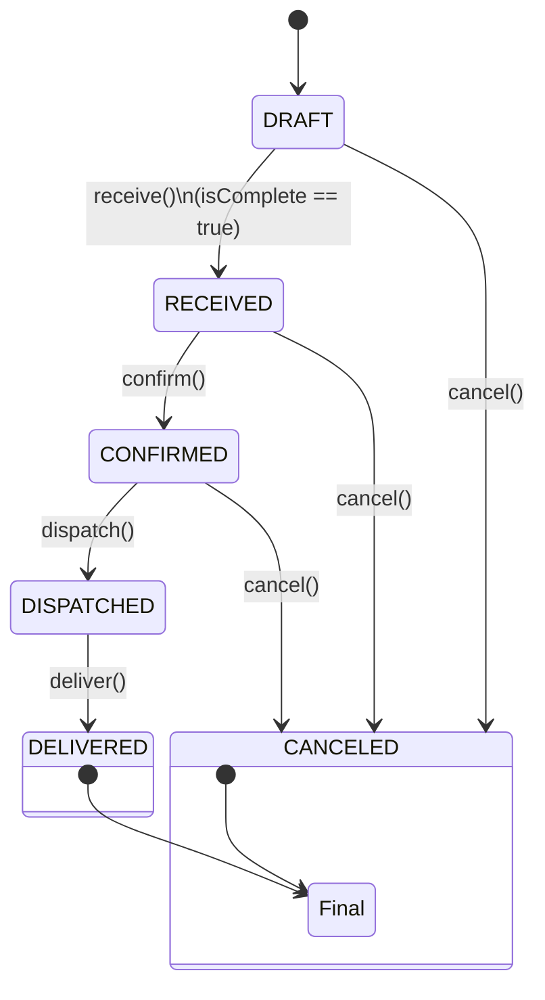

# Order API -- Especificação Oficial

## 1. Objetivo

Este documento define o contrato HTTP, regras de negócio e arquitetura
relacionadas ao Aggregate `Order`.

A API foi projetada seguindo:

- Princípios REST
- Domain-Driven Design (DDD)
- Arquitetura em camadas:
    - Controller
    - UseCase
    - Repository
    - Aggregate Root

---

## 2. Conceito Central

`Order` é o Aggregate Root.

Toda modificação estrutural ou transição de estado deve ocorrer
exclusivamente através do Aggregate.

Nenhuma regra de negócio deve estar no Controller.

---

## 3. Estados do Pedido

Estados possíveis:

- DRAFT
- RECEIVED
- CONFIRMED
- DISPATCHED
- DELIVERED
- CANCELED

### Estado Inicial

Todo pedido nasce obrigatoriamente como:

DRAFT

---

## 4. Regras Gerais

1.  Alterações estruturais só são permitidas em DRAFT.
2.  Após sair de DRAFT, o pedido torna-se estruturalmente imutável.
3.  Transições de estado devem respeitar a máquina de estados.
4.  O status nunca deve ser alterado diretamente via PATCH.
5.  O ID do pedido deve ser enviado exclusivamente na URL.
6.  **Apenas 1 pagamento é permitido por pedido.**
7.  O valor do pagamento é calculado automaticamente com base no total dos items.
8.  Formas de pagamento aceitas: CREDIT_CARD, DEBIT_CARD, CASH, PIX, VR.

---

## 5. Rotas da API

### 5.1 Criação

#### Criar Pedido

POST /orders

```json
{
    "storeId": "uuid (opcional)",
    "customer": {
        "name": "string",
        "phone": "string"
    }
}
```

**Regras:**

- O campo `storeId` é opcional e usa um valor padrão se não fornecido
- Todo pedido é criado no estado DRAFT

Resposta (201):

```json
{
  "store_id": "uuid",
  "order_id": "uuid",
  "order": {
    "payments": [],
    "last_status_name": "DRAFT",
    "store": {
      "name": "string",
      "id": "uuid"
    },
    "total_price": 0,
    "items": [],
    "created_at": timestamp,
    "statuses": [
      {
        "name": "DRAFT",
        "created_at": timestamp,
        "origin": "CUSTOMER"
      }
    ],
    "customer": {
      "temporary_phone": "string",
      "name": "string"
    },
    "delivery_address": null
  }
}
```

---

### 5.2 Consulta

#### Listar pedidos

GET /orders

**Implementação atual:** Retorna todos os pedidos sem filtros.

**Filtros planejados (não implementados):**

GET /orders?status=CONFIRMED\
GET /orders?storeId=uuid

---

#### Buscar pedido por ID

GET /orders/:id

Retorna snapshot completo do pedido.

---

### 5.3 Construção Incremental (Somente DRAFT)

#### Adicionar Item

POST /orders/:id/items

```json
{
    "code": 123,
    "quantity": 1,
    "observations": "Opcional",
    "name": "Opcional"
}
```

**Regras:**

- `code`: Código numérico do produto (obrigatório)
- `quantity`: Quantidade do produto, mínimo 1 (obrigatório)
- `observations`: Observações sobre o item (opcional)
- `name`: Nome personalizado do produto (opcional)
- O preço (`price`) é calculado automaticamente pelo sistema baseado no código do produto
- Pedido deve estar em estado DRAFT

---

#### Atualizar Item

PATCH /orders/:id/items/:code

Permite atualizar um item existente no pedido.

```json
{
    "quantity": 3,
    "name": "Nome atualizado",
    "observations": "Novas observações"
}
```

**Regras:**

- Todos os campos são opcionais, mas pelo menos um deve ser fornecido
- `quantity`: Nova quantidade (deve ser ≥ 1)
- `name`: Novo nome do item
- `observations`: Novas observações
- O preço (`price`) NÃO pode ser alterado (vem do catálogo)
- Pedido deve estar em DRAFT

---

#### Remover Item

DELETE /orders/:id/items/:code

**Status:** ⚠️ **Não implementado ainda**

---

#### Adicionar Pagamento

POST /orders/:id/payments

```json
{
    "origin": "CREDIT_CARD | DEBIT_CARD | CASH | PIX | VR",
    "prepaid": true
}
```

**Regras:**

- Apenas 1 pagamento por pedido
- Valor é calculado automaticamente do total dos items
- Pedido deve ter items antes de adicionar pagamento
- **POST sobrescreve o pagamento existente** (não há necessidade de DELETE)

---

#### Adicionar/Atualizar Endereço de Entrega

POST /orders/:id/delivery-address

```json
{
    "street_name": "string",
    "street_number": "string",
    "city": "string",
    "state": "string",
    "postal_code": "string",
    "country": "string",
    "neighborhood": "string (opcional)",
    "reference": "string (opcional)"
}
```

**Regras:**

- Campos obrigatórios: street_name, street_number, city, state, postal_code, country
- Campos opcionais: neighborhood, reference
- **Geocoding automático**: As coordenadas (latitude, longitude, id) são calculadas automaticamente via OpenStreetMap Nominatim se não fornecidas
- Se o geocoding falhar ou tiver baixa confiança, coordinates será null (sem bloquear o pedido)
- Pode enviar coordinates manualmente no body para sobrescrever o cálculo automático
- **POST sobrescreve o endereço existente** (idempotente - não há necessidade de DELETE)
- Pedido deve estar em DRAFT

---

#### Atualizar Cliente

PATCH /orders/:id/customer

**Status:** ⚠️ **Não implementado ainda**

---

### Regra Importante

Todas as rotas acima devem validar:

order.status === DRAFT

Caso contrário, retornar erro de regra de negócio.

---

### 5.4 Transições de Estado

Essas rotas representam comandos de domínio.

#### Receber Pedido

POST /orders/:id/receive

Transição:

DRAFT → RECEIVED

---

#### Confirmar Pedido

POST /orders/:id/confirm

Transição:

RECEIVED → CONFIRMED

---

#### Despachar Pedido

POST /orders/:id/dispatch

Transição:

CONFIRMED → DISPATCHED

---

#### Entregar Pedido

POST /orders/:id/deliver

Transição:

DISPATCHED → DELIVERED

---

#### Cancelar Pedido

POST /orders/:id/cancel

Permitido em:

- DRAFT
- RECEIVED
- CONFIRMED

---

## 6. Fluxo Arquitetural

Todas as rotas devem seguir:

Controller → UseCase → Aggregate → Repository

Controller: - Extrai parâmetros - Chama UseCase - Retorna resposta HTTP

UseCase: - Busca pedido no Repository - Executa método no Aggregate -
Persiste alterações

Aggregate: - Contém regras de negócio - Valida transições - Valida
construção estrutural

Repository: - Responsável por persistência

---

## 7. Máquina de Estados

Fluxo válido:

DRAFT\
↓\
RECEIVED\
↓\
CONFIRMED\
↓\
DISPATCHED\
↓\
DELIVERED

Cancelamento permitido até CONFIRMED.

---

## 8. Padrões REST Utilizados

- Substantivos no plural
- Sem verbos nas rotas
- Ação definida pelo método HTTP
- Comandos de domínio explícitos (receive, confirm, etc.)

---

## 9. Diretrizes para Implementação

- Nunca alterar status diretamente via update.
- Nunca permitir modificação estrutural fora de DRAFT.
- Nunca colocar regra de negócio no Controller.
- Validar todas as transições no Aggregate.
- UseCases devem ser específicos por ação.

---

## 10. Resultado Esperado

- API consistente
- Separação clara entre estrutura e comportamento
- Código alinhado com DDD
- Base sólida para evolução futura

---

## 11. Status de Implementação

### ✅ Implementado

**Criação e Consulta:**

- ✅ POST /orders - Criar pedido
- ✅ GET /orders - Listar pedidos
- ✅ GET /orders/:id - Buscar pedido por ID
- ✅ POST /orders/:id/items - Adicionar item ao pedido
- ✅ PATCH /orders/:id/items/:code - Atualizar item no pedido
- ✅ POST /orders/:id/payments - Adicionar pagamento/atualizar ao pedido
- ✅ POST /orders/:id/delivery-address - Adicionar/atualizar endereço de entrega

**Transições de Estado:**

- ✅ POST /orders/:id/receive - Transição DRAFT → RECEIVED
- ✅ POST /orders/:id/confirm - Transição RECEIVED → CONFIRMED
- ✅ POST /orders/:id/dispatch - Transição CONFIRMED → DISPATCHED
- ✅ POST /orders/:id/deliver - Transição DISPATCHED → DELIVERED
- ✅ POST /orders/:id/cancel - Cancelar pedido (DRAFT|RECEIVED|CONFIRMED → CANCELED)

**Features Especiais:**

- ✅ Geocoding automático com OpenStreetMap Nominatim
- ✅ Cálculo automático de preços de items
- ✅ Cálculo automático de valor de pagamento
- ✅ Validação de fluxo: items → payment → delivery address
- ✅ Payment override (POST /payments sobrescreve pagamento existente)
- ✅ Delivery address override (POST /delivery-address sobrescreve endereço existente)

### ⚠️ Não Implementado

**Operações de Edição/Remoção:**

- ⚠️ DELETE /orders/:id/items/:code - Remover item
- ⚠️ PATCH /orders/:id/customer - Atualizar cliente

### ❌ Removido da Especificação

**Rotas desnecessárias** (POST já sobrescreve os dados):

- ❌ DELETE /orders/:id/payments - Removido (POST /payments sobrescreve)
- ❌ DELETE /orders/:id/delivery-address - Removido (POST /delivery-address sobrescreve)

### State Diagram - Order Lifecycle


